# Checklist

Ask is to meet at least 4 of the 6 options:

| Instructor criteria                                                                                                                                                                                            | This project                                                                                                                                                                           |
|----------------------------------------------------------------------------------------------------------------------------------------------------------------------------------------------------------------|----------------------------------------------------------------------------------------------------------------------------------------------------------------------------------------|
| Add custom JavaScript (e.g. incorporate dynamic content, use JS to perform verification, modify the DOM)                                                                                                       | Form validation and go to top button                                                                                                                                                   |
| Enhance the accessibility of your page (e.g. put your site through the some subset of the WebAIM quick evaluation reference)                                                                                   | Page validates on WAVE and w3                                                                                                                                                          |
| Incorporate plugins (e.g. Google Calendar, a map, parallax, etc.) You will need to show what you did other than just copying code.  Did you need to change any of the attributes? Change any of the links? | Used `accordion plugin` in FAQ section and `scrollspy plugin` for highlighting navigation links.  See https://github.com/twbs/bootstrap/issues/36431 for scrollspy related issues. |
| Include a Carousel for your images (don't forget to turn off the automatic start feature if you can!!)                                                                                                         | Testimonials are within a carousel that doesn't autoplay.                                                                                                                              |
| Use a sticky footer to create a consistent look across different browser heights (we usually only consider widths…)                                                                                            | Yes. You can delete sections within the main page and the footer will stick to the bottom of the page.                                                                                 |
| Add a third viewport layout (e.g. a table view that is different than mobile or large-screen)                                                                                                                  | 3 different layouts have been implemented. `Table view` is considered obsolete with the popularity of grid and flex. So, it's left out.                                                |

***Notes:***

1. For rest of the sections, please click on the image to view the larger image in a new tab.
2. Images are shown from smallest to largest sizes from left to right in the images.

# W3 validation pass

<a href="markdown_pics/w3-validator.png" target="_blank">
    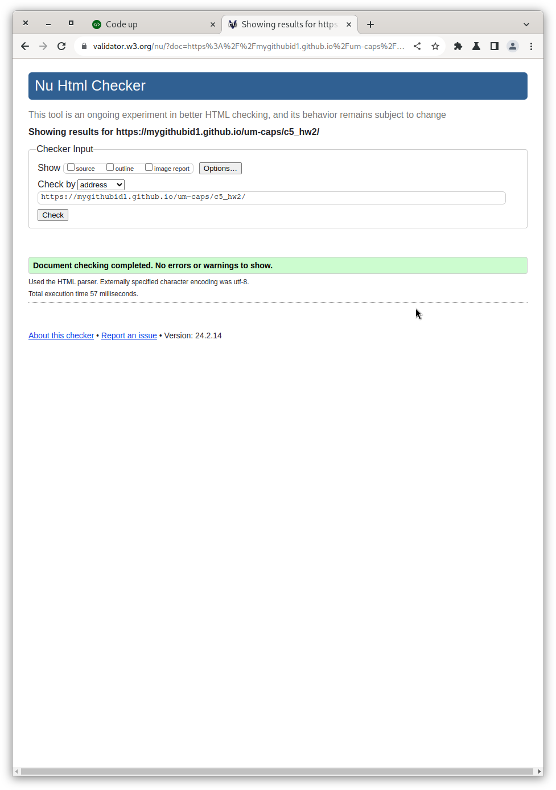
</a>

# WAVE pass

<a href="markdown_pics/wave.png" target="_blank">
    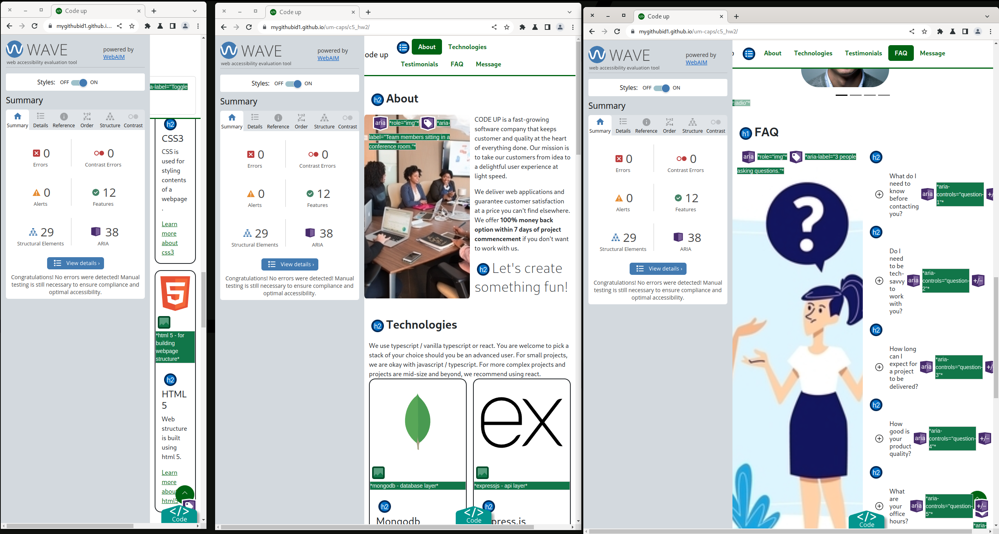
</a>

# Top nav bar

Top nav is is hidden for mobile screens and automatically expanded for larger layouts.

<a href="markdown_pics/nav-about-me-1.png" target="_blank">
    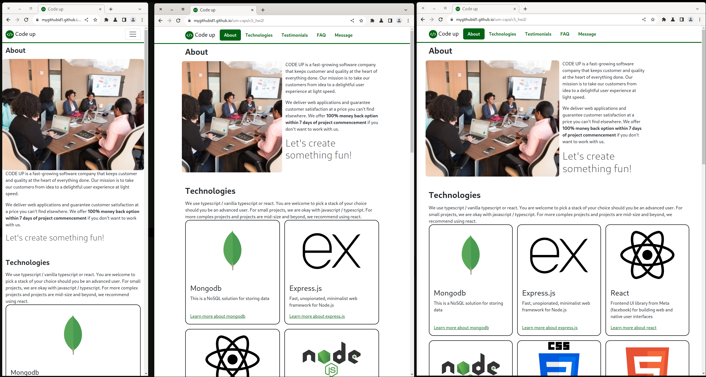
</a>

Please see below the expanded navbar for mobile screens. This was customized via scss to make it switch from a pill like
view to vertically aligned with navigation names left aligned.

<a href="markdown_pics/nav-about-me-2.png" target="_blank">
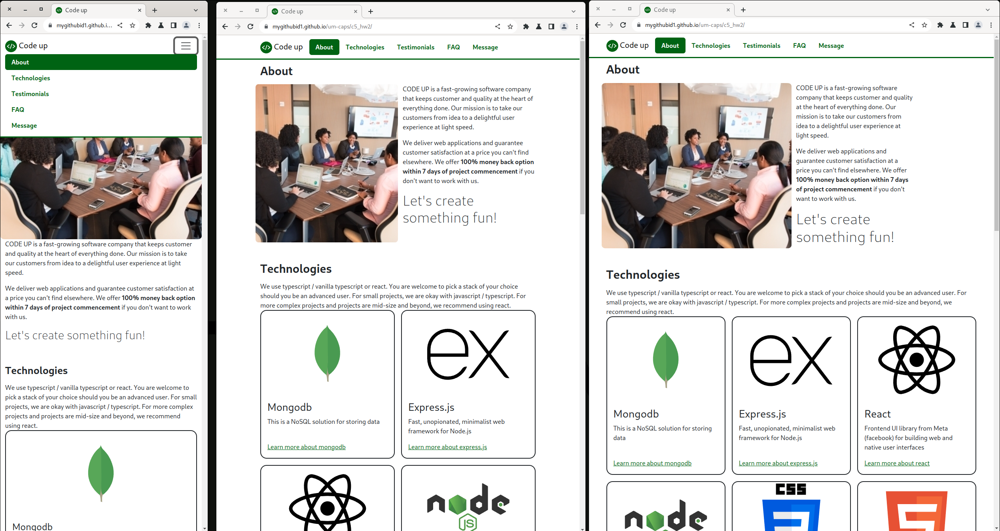
</a>

Scrollspy is used to track navigation position by highlighting where you are withing the page.
There are issues with this plugin with the latest version of bootstrap.
See https://github.com/twbs/bootstrap/issues/36431 for more details.

# About section

| Left most window (smallest)              | Middle window                       | Right window                                                                  |
|------------------------------------------|-------------------------------------|-------------------------------------------------------------------------------|
| Picture and text are aligned vertically. | Picture and text have equal widths. | The text not spanning the full available width. It makes text easier to read. |

# Technologies section

1. Hover over a card to observe the outline change from black to the primary color.
2. Click on the link within a card to visit the corresponding website.

<a href="markdown_pics/technologies.png" target="_blank">
    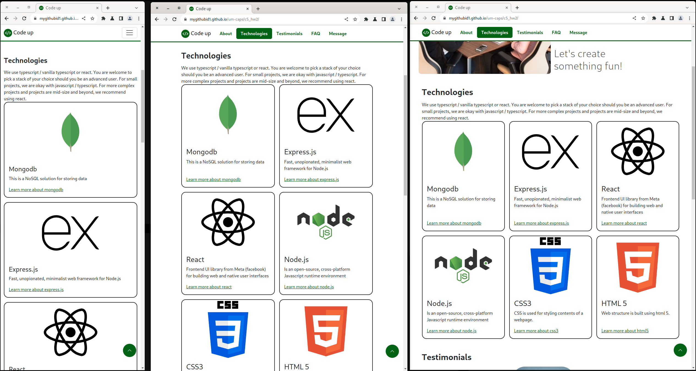
</a>

| Left most window (smallest)   | Middle window             | Right window              |
|-------------------------------|---------------------------|---------------------------|
| Cards are vertically aligned. | There are 2 cards per row | There are 3 cards per row |

# Testimonial section

1. This is implemented using a carousel without autoplay.
2. The buttons are deliberately placed away from the content.

<a href="markdown_pics/testimonial.png" target="_blank">
    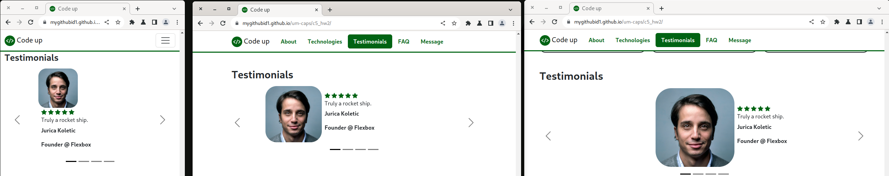
</a>

| Left most window (smallest)                                                                                          | Middle window                                                                                                                                                       | Right window                                                                                                                               |
|----------------------------------------------------------------------------------------------------------------------|---------------------------------------------------------------------------------------------------------------------------------------------------------------------|--------------------------------------------------------------------------------------------------------------------------------------------|
| Customer image and text are vertically aligned.   Carousel inner content is placed close to the previous button. | Customer image is made bigger.  Text content is vertically centered within the container.  Carousel content is moved further away from the previous button. | Image is made bigger. Text is center aligned within the container. The inner container is moved to almost middle of the container. |

# FAQ section

1. Click on a question and the `+` mark will expand to reveal the answer and will turn into an `x` mark.
2. Click on the `x` mark to hide the answer.
3. The accordion is customized to show custom expand and collapse buttons along with positioning the buttons at start
   rather than the default end position.

Image for left most and middle entries of table below:

<a href="markdown_pics/faq-p1.png" target="_blank">
    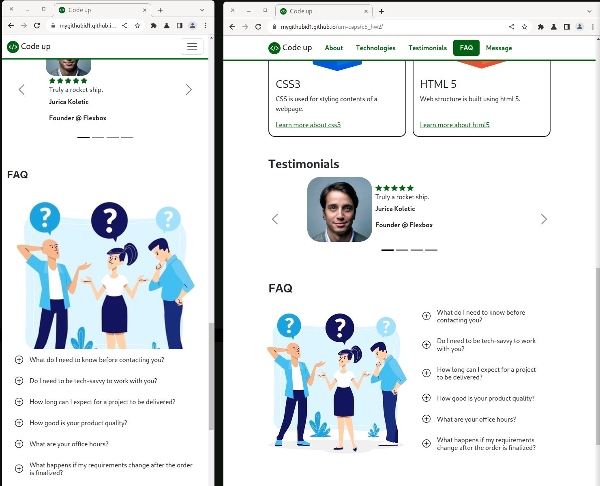
</a>

Image for right section in table below:

<a href="markdown_pics/faq-p2.png" target="_blank">
    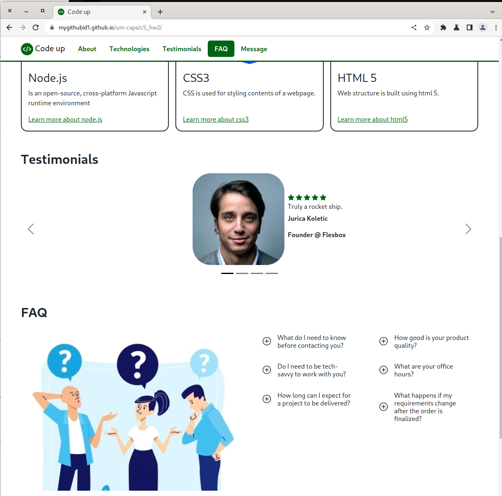
</a>

| Left most window (smallest)                 | Middle window                                                                                        | Right window                                                                     |
|---------------------------------------------|------------------------------------------------------------------------------------------------------|----------------------------------------------------------------------------------|
| Image and questions are vertically stacked. | Questions and image are horizontally aligned. The questions themselves are still vertically aligned. | This follows a 3 column layout. Image and questions are spread out horizontally. |

# Message section

<a href="markdown_pics/message.png" target="_blank">
    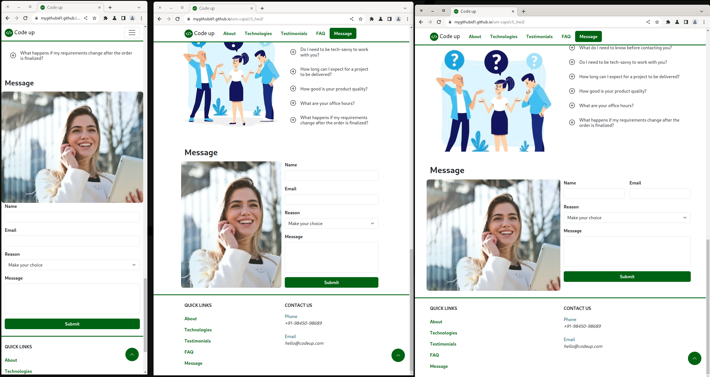
</a>

| Left most window (smallest)                   | Middle window                                                                      | Right window                                                                                                                                             |
|-----------------------------------------------|------------------------------------------------------------------------------------|----------------------------------------------------------------------------------------------------------------------------------------------------------|
| Image and form fields are vertically stacked. | Form and image are horizontally stacked. Form fields are still vertically stacked. | Form and image are horizontally stacked. ***Name and Email*** fields are horizontally stacked. Rest of the form fields are still vertically stacked. |

### Form validation failure

Custom feedback provided when form isn't filled.

<a href="markdown_pics/message-fail.png" target="_blank">
    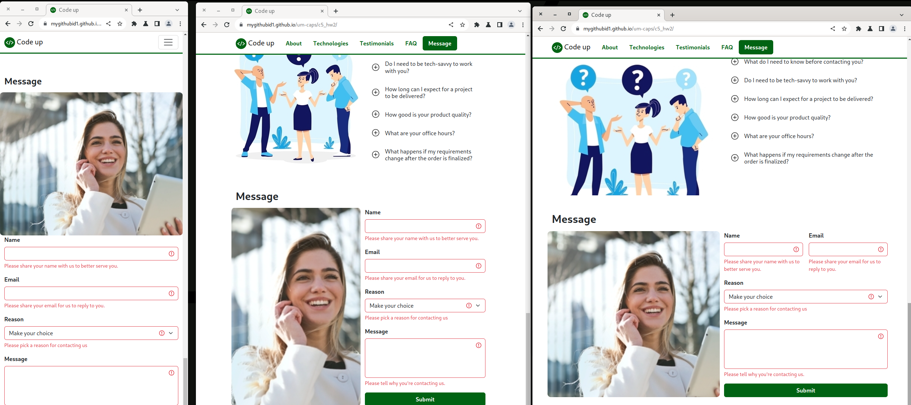
</a>

### Form validation succcess

Custom feedback provided when form is corrected with acceptable values.

<a href="markdown_pics/message-success.png" target="_blank">
    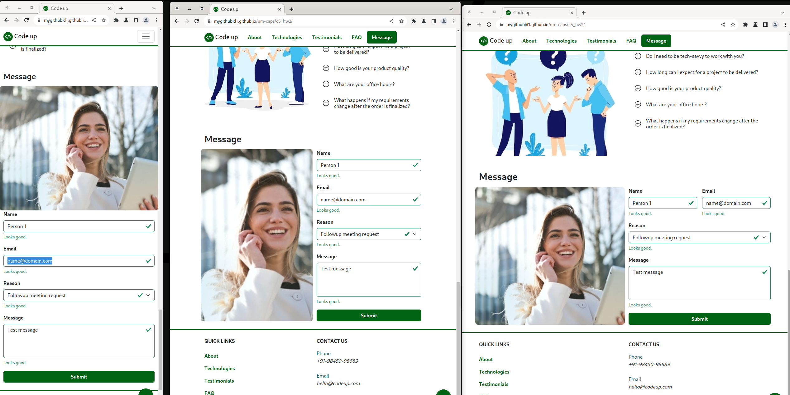
</a>

# Footer section

<a href="markdown_pics/footer.png" target="_blank">
    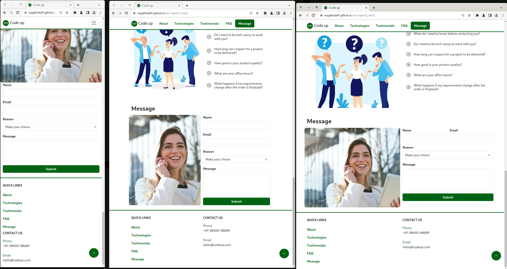
</a>

| Left most window (smallest)                 | Middle window   | Right window                     |
|---------------------------------------------|-----------------|----------------------------------|
| All footer sections are vertically aligned. | 2 column layout | 2 column layout (kept is simple) |

### Sticky footer

1. I didn't need a sticky footer for this page. But, it's still in place.
2. We've seen screenshots all along to prove that the footer is at the bottom of the page.
3. If we remove part of the webpage by removing DOM elements from the browser console, we can notice that the footer is
   still at the bottom.

<a href="markdown_pics/sticky-footer.png" target="_blank">
    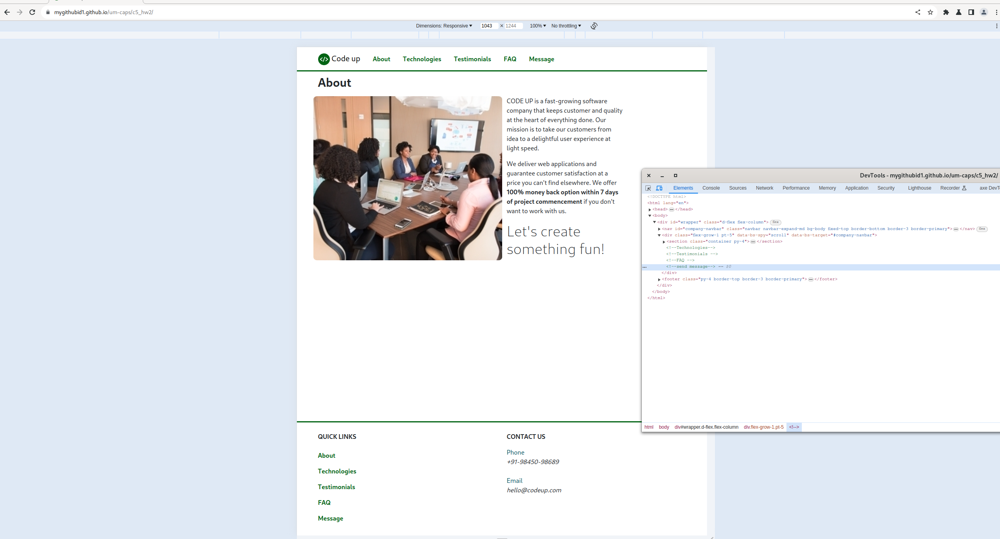
</a>

# More details

1. `Scrollspy` is left in the code to make use of the fix that bootstrap provides.
2. Make use of scroll to top button (the circular button floating in bottom left of screen) to scroll to start of page.

